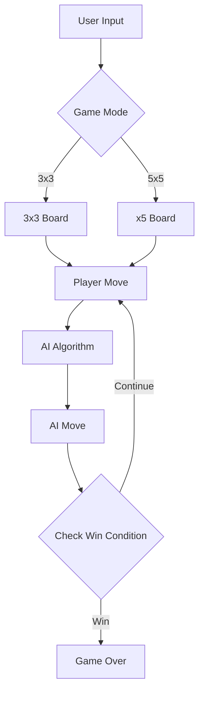

# 🎮 Tic Tac Toe: Intelligent Game Experience


## 🌟 Project Highlight

An Tic Tac Toe game that blends classic gameplay with intelligent AI and stunning visualizations.

## ✨ Key Features

| Feature | Description |
|---------|-------------|
| 🧠 Smart AI | Minimax algorithm Supervised Learning |
| 🎨 Elegant Design | Modern, responsive PyGame interface |
| 🔢 Multiple Modes | 3x3 and 5x5 board variations |
| 🤖 Intelligent Gameplay | Strategic computer opponent |

## 🚀 Quick Start

### Prerequisites
- Python 3.8+
- PyGame Library

### Installation
```bash
# Clone Repository
git clone https://github.com/rexzea/TicTacToe-AI.git

# Install Dependencies
pip install pygame
```

## 🎯 Game Modes

### 3x3 Classic


- Traditional 3x3 grid
- Quick, strategic matches
- Perfect for quick games

### 5x5 Advanced


- Larger 5x5 board
- More complex strategy
- Extended gameplay possibilities

🔥 It's impossible for you to win a battle (5x5) with AI here! 😈

## 🤖 AI Strategy: Minimax Algorithm

The AI uses the Minimax algorithm to:
- Analyze all possible move outcomes
- Select optimal strategic moves
- Predict and block players winning strategies


## 🖥️ Gameplay Mechanics

1. Choose game mode (3x3/5x5)
2. Click grid to make moves
3. AI responds intelligently
4. Win by creating consecutive symbol line

## 🔧 Technical Architecture



## 🌈 Visualization

- Responsive design
- Elegant symbol rendering
  

## 📄 License
MIT License

## 🤝 Contributions
Contributions are welcome! 
- Fork the project
- Create feature branch
- Commit changes
- Push to branch
- Open pull request
